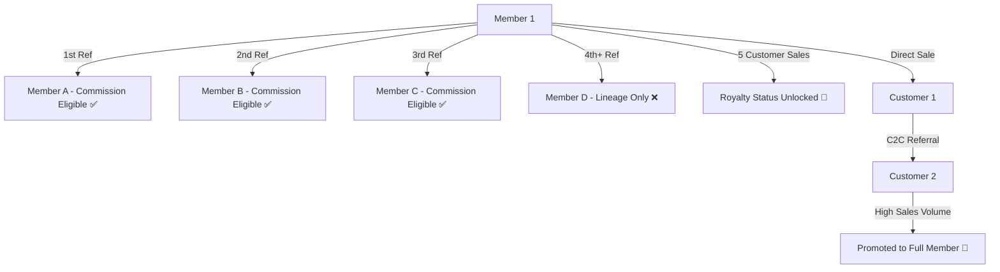

# 🚀 3% Real Estate Network & Referral System Specification

## 1. Executive Summary & Objectives

This document specifies the complete operational, architectural, and business logic requirements for the **3% Real Estate Network & Referral System**. 

The system is designed to:
1. Track member-to-member and customer-to-customer network lineage at million-user scale.
2. Enforce strict commission eligibility rules (First 3 Member referrals).
3. Automate Royalty status rewards upon reaching customer milestones (5 Active Customer referrals).
4. Support seamless Customer-to-Member promotion for top performers.
5. Provide a multi-factor **Global Cross-Project Blacklist Engine** to protect inventory across all real estate projects.

---

## 2. Detailed Network Hierarchy & Business Rules



### 2.1 Member-to-Member (M2M) Referral Engine
- **Unlimited Lineage:** Any member can refer an unlimited number of new members to expand the network tree.
- **The "First 3" Commission Rule:**
  - Only the **first 3 referred members** (ordered strictly by registration timestamp `created_at` ASC) are marked `is_commission_eligible = true`.
  - Referred members from #4 onward remain linked to the parent member for network reporting and genealogy, but are flagged `is_commission_eligible = false`.
  - Payment calculation logic strictly filters for `is_commission_eligible = true`.

### 2.2 Member-to-Customer (M2C) & Royalty Threshold
- **Direct Customer Referrals:** Members can refer customers directly for plot allotments.
- **5-Customer Royalty Milestone:**
  - When a member completes **5 verified customer plot purchases**, the system triggers a **Royalty Status Upgrade** (`royalty_unlocked = true`).
  - Royalty unlocks special incentive tiers, priority plot access, and dashboard badges.

### 2.3 Customer-to-Customer (C2C) Referrals
- Customers can refer other buyers to purchase plots.
- The referring customer receives standard referral credits or deal-based rewards.

### 2.4 Customer-to-Member Direct Promotion Workflow
- Top-performing customers (based on plot purchase volume or total C2C referral sales) can be promoted directly to **Full Member Status** by an Administrator or MD.
- **Lineage Transfer:** Upon promotion:
  1. A new `member_code` (e.g., `3C010`) is generated for the user.
  2. All existing sub-customers referred by this person retain their historical referral connection under the newly minted Member profile.
  3. Historical transaction records remain immutable.

---

## 🛡️ 3. Global Anti-Fraud & Cross-Project Blacklist Engine

If a customer is blacklisted (due to payment default, legal dispute, fraudulent paperwork, or policy violations), they **must be blocked from buying plots in any project** across the entire 3% Real Estate platform.

### 3.1 Multi-Factor Fingerprinting
The Blacklist Engine checks three identity signals:
1. **Primary Key (Mobile Match):** Exact match on 10-digit mobile number.
2. **Secondary Key (Aadhaar Match):** Match on encrypted Aadhaar identity hash.
3. **Fuzzy Name + Location Match:** Soft match on normalized Full Name + City (flags transaction for manual Admin review).

### 3.2 Transaction Enforcement Workflow
```
[New Allotment / Plot Booking Request]
              │
              ▼
    ┌───────────────────┐
    │ Check Blacklist   │
    │ Fingerprint Engine│
    └─────────┬─────────┘
              │
      ┌───────┴───────┐
      │               │
  [Match Found]   [No Match]
      │               │
      ▼               ▼
 ⛔ Transaction   ✅ Proceed with
    BLOCKED          Allotment
 (Alert sent to MD)
```

---

## 🚨 4. Loophole & Risk Audit

| Risk / Loophole | Description | System Mitigation Strategy |
| :--- | :--- | :--- |
| **Dummy Member Camping** | A member registers 3 dummy family accounts first to hog the "First 3" slots before inviting real active members. | Require slot locking only after the referred member completes their first active customer sale or plot allotment. |
| **Customer Splitting for Royalty** | A member splits 1 real customer's multiple plot purchases across 5 dummy customer names to hit the Royalty threshold. | Enforce distinct Mobile & Aadhaar validation (`COUNT(DISTINCT customer_mobile) >= 5`). |
| **Blacklist Evasion via Relative Accounts** | A blacklisted individual buys a plot under a spouse/sibling's name in a different project. | Implement a **Co-Buyer / Alternate Contact** matching rule that flags shared addresses or alternate phone numbers. |
| **C2M Lineage Conflict** | When a customer becomes a member, does the original referring member lose credit? | The original referring member continues to receive tier credit for the promoted user's original purchase snapshot; new sales follow the promoted user's new Member tree. |

---

## 🗄️ 5. Technical Implementation & Data Schema Plan

### 5.1 Schema Extensions (Prisma / PostgreSQL)

```prisma
// Member Model Updates
model Member {
  id                      String    @id @default(uuid())
  member_code             String    @unique
  name                    String
  mobile                  String    @unique
  referred_by_member_id   String?
  is_commission_eligible  Boolean   @default(false) // Set to true for first 3 referrals
  royalty_unlocked        Boolean   @default(false) // Set to true upon 5 customer sales
  is_blacklisted          Boolean   @default(false)
  created_at              DateTime  @default(now())
  
  // Relations
  referred_by             Member?   @relation("MemberToMember", fields: [referred_by_member_id], references: [id])
  referred_members        Member[]  @relation("MemberToMember")
  customers               Customer[]
}

// Customer Model Updates
model Customer {
  id                      String    @id @default(uuid())
  customer_code           String    @unique
  name                    String
  mobile                  String    @unique
  aadhaar_last4           String?
  referred_by_member_id   String?
  referred_by_customer_id String?
  is_blacklisted          Boolean   @default(false)
  promoted_to_member_id   String?   // Pointer if upgraded to Member
  created_at              DateTime  @default(now())
}

// Blacklist Registry Model
model BlacklistRegistry {
  id             String   @id @default(uuid())
  entity_type    String   // "CUSTOMER" | "MEMBER"
  entity_id      String
  name           String
  mobile         String
  aadhaar_last4  String?
  reason         String
  blacklisted_by String
  created_at     DateTime @default(now())
}
```

---

## 🏁 6. Actionable Implementation Roadmap

1. **Phase 1: Lineage & First-3 Logic**
   - Automatically assign `is_commission_eligible = true` for the first 3 child members per parent.
2. **Phase 2: Royalty Calculation Engine**
   - Add background trigger to evaluate active customer count and set `royalty_unlocked = true` when count reaches 5.
3. **Phase 3: Global Blacklist Engine**
   - Build `BlacklistRegistry` table and intercept all plot allotment workflows with multi-factor fingerprint checks.
4. **Phase 4: Customer-to-Member Promotion Workflow**
   - Add admin action button on Customer Profile to convert Customer → Member while preserving referral history.
